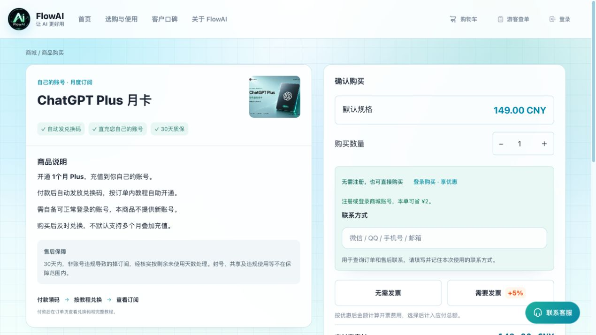

# 【亲测可用】国内 ChatGPT 充值与代充教程 2026：支付宝开通 Plus / Pro、Codex 与续费

国内怎么给 ChatGPT 充值？没有海外信用卡能不能购买 Plus？想用微信、支付宝或苹果礼品卡付款，应该走哪个入口？这份指南从**付款方式、自己的账号开通、朋友代付、Pro 续费和 Codex 使用**讲起，帮助你找到适合自己的流程。

这里的人民币购买示例来自 **FlowAI 自营商城**。当前公开商品页提供支付宝付款；花呗、信用卡是否可选，以实际支付宝收银台为准。微信联系方式不等于微信支付通道。官方订阅、手机内购与第三方服务的条件不同，先看清楚再付款。

**内容与截图核对：2026年10月4日** · [FlowAI 商城](https://ai0111.com/)

**亲测说明：**“亲测可用”基于 FlowAI 经营者本人成功开通或续费的使用经历；具体套餐、付款方式与账号适用条件以当前商品页为准。

## 国内购买 ChatGPT，先找到自己的问题

| 你想解决的问题 | 对应教程 |
|---|---|
| 没有海外信用卡，想用人民币给自己的账号开通 | [支付宝购买 Plus / Pro 的五步操作](docs/buy-and-renew.md) |
| 比较微信、支付宝、信用卡、PayPal、App Store 礼品卡 | [ChatGPT 充值方法与支付方式比较](docs/payment-methods.md) |
| 想让朋友帮忙付费，或给别人买会员 | [朋友代付、礼品卡与代充服务怎么选](docs/friend-payment.md) |
| 准备购买或续费 Pro，不清楚 Pro5x、200、500 的区别 | [ChatGPT Pro 充值与续费指南](docs/pro-recharge.md) |
| 已经有 Plus，Codex 还要单独付费吗？ | [Codex 订阅额度、额外 credits 与 API 计费区别](docs/codex-and-chatgpt.md#已经有-plus还要再买-codex-订阅吗) |
| 已付款，找不到订单、兑换码或发票入口 | [游客查单、会员优惠与企业开票](docs/orders-and-invoices.md) |

## 人民币代充：怎样给自己的 ChatGPT 账号开通？

“ChatGPT 代充”通常指通过服务商付款和交付流程，为已有账号办理对应会员。购买前先看商品究竟是**自己的账号开通、共享账号，还是另行提供账号**。这些方式的账号归属、聊天记录和售后不同，不能只比价格。

FlowAI 当前 Plus 自助月卡的流程是：**商城付款 → 订单领取兑换码 → 按订单教程提交开通 → 回到自己的 ChatGPT 账号核对订阅**。商城已发码与账号会员已生效是两件事。人工交付商品要按它自己的说明操作。

*图：2026年10月4日公开页面。截图用于认识按钮和步骤；价格、优惠及库存以当前商品页为准，未进行真实付款或兑换。*

如果希望使用人民币、保留自己的账号，并需要订单查询或企业发票，可以先比较 FlowAI 的[购买与续费步骤](docs/buy-and-renew.md)。已有符合官方条件的账号和付款方式，也可以从[官方套餐说明](https://learn.chatgpt.com/docs/pricing)核对官方订阅。第三方商品的适用条件、交付时间和售后由商品页面说明，不等于 OpenAI 官方承诺。

## 用支付宝购买 ChatGPT 会员，怎么给自己的账号开通？

### 第一步：确认套餐和要开通的账号

先确认准备开通的 ChatGPT 账号能正常登录，再选套餐周期及交付方式。有未到期的订阅时，先核对续费条件，不默认剩余时间可以叠加。

- [ChatGPT Plus 月卡：自动发兑换码，自助提交开通](https://ai0111.com/products/chatgpt%20plus)
- [ChatGPT Pro5x 月卡：自动发兑换码，自助提交开通](https://ai0111.com/products/ChatGPT%20Pro5x)
- [ChatGPT Pro 200 月卡：付款后按订单说明人工处理](https://ai0111.com/products/ChatGPT%20Pro20)
- [ChatGPT Plus 年卡：12个月服务，付款后人工交付年卡 CDK](https://ai0111.com/products/gpt-plus-annual)
- [ChatGPT Pro 500 月卡：先联系客服确认付款与开通安排](https://ai0111.com/products/chatgpt-pro-500)

Pro 500 的「联系客服开通」入口本身不创建订单、不扣款。Plus 年卡是 FlowAI 的12个月会员服务商品，不据此推定 OpenAI 官方提供个人 Plus 年付订阅。[五种商品怎么选](docs/choose-plan.md#月卡年卡和-pro-各档购买方式有什么不同)

### 第二步：选择登录购买或游客购买

已有 FlowAI 账号可点「登录购买 · 享优惠」；暂不注册可填写联系方式购买，并记住原联系方式用于查单。**商城账号用于购买和查单，ChatGPT 账号用于使用会员**，不要混淆。

### 第三步：确认优惠、发票和付款金额

核对数量、适用优惠与开票选择后付款。需要发票时先选「需要发票」，再确认调整后的金额。支付宝内的花呗或信用卡等付款方式，以本次收银台实际显示为准。[开票与金额说明](docs/orders-and-invoices.md#为什么登录后或选择开票后价格会变化)

### 第四步：在订单中领取兑换码并提交开通

Plus 自助月卡付款确认后自动发放 CDK。打开订单详情，从该订单提供的入口按教程核对账号、提交开通。人工交付商品按订单指引处理，不套用自动发码流程。

### 第五步：回 ChatGPT 核对会员状态

在同一个 ChatGPT 账号查看套餐状态及到期信息。已付款但未开通，先查[具体停在哪一步](docs/buy-and-renew.md#已付款但还不能使用先确定停在哪一步)，不要因结果不明重复付款或重复提交兑换码。

## 海外信用卡、虚拟信用卡和 PayPal 充值怎么比较？

走官方网页订阅时，先检查账号购买条件及结算页可用方式。银行卡是否被接受，取决于实际支付条件；虚拟信用卡还需核对发行方、费用、续费扣款及退款处理，不能因为教程列出某种卡就保证能用。

PayPal 是否出现，也应以目标产品、地区和结算页为准。FlowAI 当前商品页显示的是支付宝入口，不能把官方渠道或其他商家的支付方式套到本站。详见[充值方法比较](docs/payment-methods.md)。

## App Store 苹果礼品卡能给 ChatGPT 充值吗？

手机用户可以在 ChatGPT 官方应用中核对是否提供所需套餐的应用内订阅。苹果礼品卡通常先兑换到匹配地区的 Apple Account 余额，再确认该订阅能否用余额支付；余额可以用于部分订阅，但部分购买仍需要有效付款方式。不能把“买到礼品卡”直接视为“ChatGPT 已订阅成功”。

核对商店地区、内购入口和续费管理，比套用旧的“必须美区账号”教程更可靠。Android 用户同样要看实际 Google Play 内购入口。[苹果礼品卡与手机内购说明](docs/payment-methods.md#app-store-礼品卡与-google-play-内购)

## 朋友帮忙代付，与共享账号有什么区别？

朋友帮付款时，要确认钱付到哪笔订单、给哪个账号开通，以及后续由谁管理续费、查单和发票。支付人和使用会员的人可以不同，但交付结果必须按实际流程核对。

共享账号则涉及多人使用同一账号，可能无法保留自己的使用习惯或独立管理订阅。希望继续使用自己账号的人，应核对商品明确写的是自己的账号开通。[朋友代付与给别人买会员的完整说明](docs/friend-payment.md)

## ChatGPT Plus 和 Pro 怎么选？

- **日常写作、学习、文件整理或偶尔开发：** 先比较 Plus 的当前功能与限制。
- **经常使用 Codex 或集中处理长任务：** 记录真实额度中断，再比较 Pro 和预算。
- **已有高强度需求：** 再看 Pro 200、Pro 500 的当前权益与交付条件，不把商品名称理解成所有任务无限使用。

商城当前名称为 Pro5x、Pro 200、Pro 500。旧教程里的 Pro20x、10x 等称呼不能自动等同于现在的固定任务倍数；Pro 200 保留原商品链接。[套餐对比](docs/choose-plan.md) · [Pro 购买与续费](docs/pro-recharge.md)

## GPT 模型更新后，Plus 和 Codex 怎么用？

Plus / Pro 是订阅套餐，Astra、Sol、Terra、Luna 等是模型家族名称；看到模型更新，不代表需要另买一张“模型版本充值卡”。不同产品中的模型入口也可能不同，按当前[官方模型说明](https://learn.chatgpt.com/docs/models)和自己账号核对。

使用 Codex 时，先分清**ChatGPT 账号登录**与 **API Key 登录**。会员权益与 API 用量计费是不同入口；会员开通不等于 API 账户已充值，也不保证所有模型或无限使用。[Codex、会员与 API 计费指南](docs/codex-and-chatgpt.md)

## 常见问题

### 没有海外信用卡，可以用支付宝购买 ChatGPT Plus 吗？

可以先查看 FlowAI 的自助月卡是否适用自己的账号，按商品页走支付宝付款。花呗、信用卡能否使用，以实际收银台显示为准，不保证所有用户都有同一组付款选项。

### 支持微信充值吗？

截至本次核对，FlowAI 公开商品页显示支付宝按钮。联系方式栏允许填写微信，表示查单和售后联系方式，不能据此认为支持微信支付。想比较微信付款与其他渠道，先看[支付方式说明](docs/payment-methods.md#支付宝花呗信用卡和微信支付)。

### CDK 是填到 ChatGPT 官方网站兑换吗？

按商城订单提供的指定入口和教程使用，不要自行把商城兑换码当成官方礼品码。发码后仍需完成开通步骤；兑换码与登录会话不要放进 GitHub 或公开截图。

### 可以提前续费或从 Plus 升级到 Pro 吗？

先核对当前套餐、到期时间、新商品适用条件及剩余时间如何处理。未写明时先咨询商城客服，不默认提前充值会叠加天数；正在处理的任务不要重复提交。

### 已有商城账号，还要重新注册吗？

不需要。登录原商城账号再购买；游客订单仍用下单时联系方式查询，后来注册不会自动合并旧游客订单。[查订单与兑换码](docs/orders-and-invoices.md)

### 企业购买能开发票吗？

按商品提供的开票选项，付款前先选择并确认金额，再通过订单入口提交资料。能开发票不等于购买团队工作区或企业套餐。[企业开票步骤](docs/orders-and-invoices.md#需要发票在哪一步选择)

### Plus / Pro 能当 API 余额使用吗？

不能按同一个计费入口理解。先查看当前工具使用的是 ChatGPT 登录还是 API Key，再选择需要的订阅或 API 服务。[认证与计费区别](docs/codex-and-chatgpt.md)

## 专题教程目录

- [国内 ChatGPT 充值：支付宝购买、账号开通与续费](docs/buy-and-renew.md)
- [充值方法比较：信用卡、PayPal、微信与苹果礼品卡](docs/payment-methods.md)
- [ChatGPT 如何让别人代付：朋友帮买与第三方服务](docs/friend-payment.md)
- [ChatGPT Pro 充值：Pro5x、Pro 200、Pro 500](docs/pro-recharge.md)
- [ChatGPT Plus 与 Codex：登录方式、模型与 API 计费](docs/codex-and-chatgpt.md)
- [Plus / Pro 套餐选择与五类商品的交付区别](docs/choose-plan.md)
- [购买后查单、会员优惠、余额与发票](docs/orders-and-invoices.md)
- [商城内的 Plus 购买图文说明](https://ai0111.com/guides/chatgpt-plus-buy-in-china)

## 维护与来源

本指南由 **FlowAI** 维护，商城链接指向自营服务；不是 OpenAI 官方文档或独立评测。套餐、模型与认证资料参考 [OpenAI 套餐说明](https://learn.chatgpt.com/docs/pricing)、[模型说明](https://learn.chatgpt.com/docs/models)、[认证说明](https://learn.chatgpt.com/docs/auth)，支付流程按本商城公开页面整理。手机订阅条件见对应专题的 Apple 官方资料。

本轮文档维护仅核对页面与资料，未新增真实付款、兑换或开票测试。发现教程过期可按[贡献说明](CONTRIBUTING.md)反馈；订单售后请通过商城客服。觉得指南有帮助，可以收藏或 Star，方便下次续费时核对。
