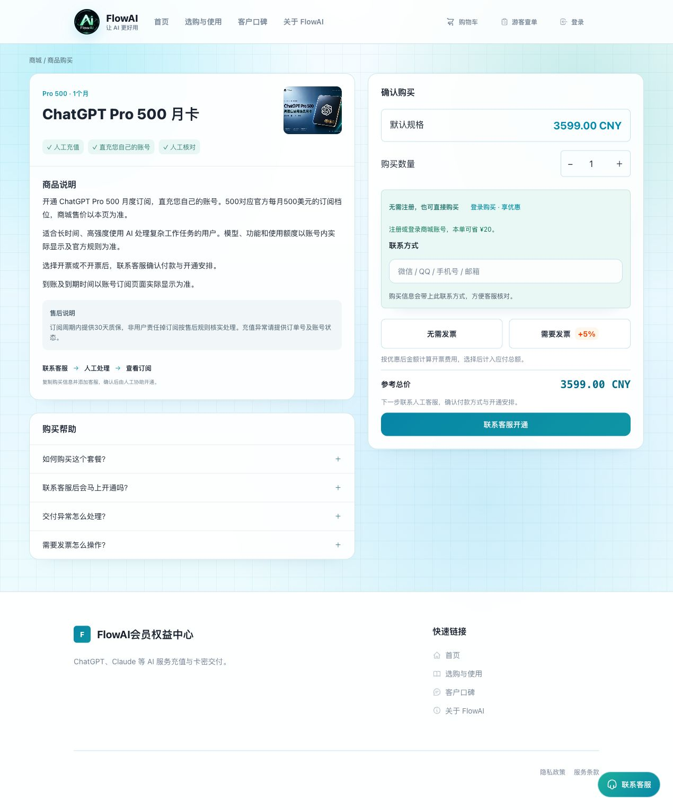

# 国内ChatGPT充值步骤：支付宝购买Plus/Pro、账号开通与续费

[返回指南首页](../README.md) · 内容核对：2026-10-04

使用支付宝购买后，怎样把会员开通到自己的 ChatGPT 账号？下面以 FlowAI 当前 Plus 自助月卡为例，从选账号到领取兑换码、提交开通和核对结果逐步说明。流程根据商城公开商品与操作说明整理。

本文截图采集于2026年10月4日，展示真实公开页面和空白表单，未进行付款或兑换。截图里的价格和开票费用仅供认识界面，实际以下单页面为准。

## 先选择购买方式

想了解 OpenAI 套餐本身，可阅读[官方套餐说明](https://learn.chatgpt.com/docs/pricing)，从官方产品入口核对支持条件和订阅方式。

选择 FlowAI 商品时，在商品页确认自己的账号是否适用、套餐周期、自动或人工交付，以及售后范围。FlowAI 当前商品页提供支付宝付款；花呗、信用卡能否使用，以实际支付宝收银台为准。需要发票时，在付款前选择相应选项并核对应付金额。

## 第一步：确认要开通的账号和商品

确认当前登录的 ChatGPT 账号就是准备开通的账号。若同时使用多个邮箱、Google 登录或其他登录方式，先在账号页面核对，不要根据浏览器头像猜测。

“自己的账号开通”与“另行交付账号”不同。前者围绕你已有账号提供对应开通服务；后者涉及另一个账号，不能假定会继承原来的聊天记录和设置。

有未到期订阅时，先看本文的续费说明。尚未选好档位，可先看[套餐选择](choose-plan.md)。

### 年卡和 Pro 500分别怎么购买？

- **Plus 年卡：** 查看[年卡商品](https://ai0111.com/products/gpt-plus-annual)中的12个月会员服务及质保范围，按商品页购买。付款后等待人工交付年卡 CDK，再从订单指定入口提交开通，最后在自己的账号核对订阅状态。不能因为买的是年卡就默认提前充值会叠加剩余时间。
- **Pro 500：** 查看[商品页](https://ai0111.com/products/chatgpt-pro-500)，选择数量及是否开票，核对参考总价，游客购买时填写联系方式，再点击「联系客服开通」。下一页提供购买信息复制和客服联系方式；客服确认后安排付款与开通。此入口本身不创建商城订单、不扣余额，也不会跳转支付宝收银台，后面的自助付款步骤不适用于它。

*图：Pro 500先联系人工客服；这里显示的是参考总价，尚未付款。*

年卡属于商城提供的服务商品；套餐权益仍以实际账号和官方规则为准。不要把年卡名称理解成 OpenAI 官方个人 Plus 年付入口。

## 第二步：选择会员购买或游客购买

| 购买状态 | 操作方式 | 之后在哪里查单 |
|---|---|---|
| 已有 FlowAI 商城账号 | 先登录，再核对商品与符合条件的优惠 | 登录同一商城账号，进入“我的订单” |
| 希望注册后购买 | 使用注册入口；已有账号可点“直接登录” | 登录完成后回到商品，再确认价格 |
| 暂不注册 | 使用游客购买，准确填写下单联系方式 | “游客查单”，使用下单时的联系方式 |

*图：Plus 月卡右侧的「确认购买」区域。先选数量和购买身份，再填写联系方式、选择是否开票。*

在「确认购买」区域按顺序操作：

1. 确认商品规格，用数量旁的「＋」「－」调整需要的数量。
2. 已有商城账号点「登录购买 · 享优惠」；游客购买准确填写「联系方式」，并记住本次填写的内容。
3. 点击「无需发票」或「需要发票」，不要漏选。
4. 看到余额选项时，决定是否使用余额；最后再核对实际在线付款金额。

会员优惠是否适用，取决于账号验证状态、商品及当前活动条件。游客购买后再注册，不会自动把那笔游客订单变成会员订单，也不要期待自动补差退优惠。

## 第三步：核对最终金额并付款

确认商品、数量、下单方式和发票选项，按结算页面显示的最终金额付款。选择开票后的费用由页面计算，不要按截图自行转账。

*图：付款前选择开票；企业名称、税号和接收邮箱在付款后的订单入口填写。*

登录购买时，若页面显示「优先使用商城余额」，可以按需要勾选或取消。想保留邀请奖励继续积攒，可以取消使用余额，再核对在线付款金额；仅钱包支付的订单应按页面提示处理。详细区别见[余额抵扣说明](orders-and-invoices.md#购物时可以不使用余额吗)。

如果在微信内付款页面提示使用外部浏览器，按页面指引继续原订单。付款结果不明确时，先查支付工具是否扣款和商城订单状态；不要直接重新下单再次支付。

## 第四步：领取兑换码，按订单说明提交开通

当前 Plus 自助月卡在付款确认后自动发放 CDK（兑换码）。在订单详情中查看交付内容和使用说明，从该订单提供的入口继续操作。

**自动发货表示兑换码已发出，不等于账号已经开通会员。** 按订单说明核对账号、提交兑换码和必要信息，等待任务处理。人工交付商品则依订单提示联系处理，不套用自助兑换流程。

兑换码不应填到不明网站。若流程要求使用登录会话等敏感信息，只在核实过的指定页面按说明操作；不要发送到 GitHub、公开聊天、评论或不明客服处，也不要把密码、短信或邮箱验证码交给他人。

## 第五步：回到自己的账号核对结果

处理完成后，回到同一个 ChatGPT 账号查看套餐状态；有到期信息时一并核对。确认的是实际账号权益，而不仅是商城显示“已发货”。

如结果与购买内容不符，保留订单信息，通过商城“联系客服”核查。不要把完整兑换码、会话内容或密码放进公开截图。

## 已有会员怎样安排续费

续费前核对当前套餐、到期时间和新商品适用条件。**不要默认提前充值会自动叠加剩余天数。** 如果说明没有明确如何处理已有订阅，先通过商城客服确认，再购买或使用兑换码。

从 Plus 更换到 Pro，也要先确认账号当前状态与交付条件。已提交的开通任务尚未结束时，不要重复提交多个兑换码或反复更换套餐。

## 已付款但还不能使用，先确定停在哪一步

| 你看到的情况 | 到哪里操作 | 怎样确认下一步 |
|---|---|---|
| 支付工具尚未确认扣款 | 打开原订单及支付工具的交易记录 | 明确是否扣款；结果不明时先查单，不重复支付 |
| 已扣款，商城仍显示待支付 | 回到原订单刷新；仍不一致时从商城联系客户服务 | 以商城服务端确认的付款状态为准；付款凭证私下提供给客服 |
| 商城已发货，ChatGPT 仍无会员 | 打开该订单「查看详情」，阅读交付内容和教程 | 确认是否领取并使用了兑换码；发码不等于会员开通 |
| 开通任务正在处理 | 回到订单指定的兑换入口查看该任务 | 按任务页面指引等待或处理，不重复提交其他兑换码 |
| 任务完成，账号套餐仍未变 | 回 ChatGPT 的账号设置核对邮箱及套餐 | 确认查看的是提交开通的同一账号；不一致时联系客服 |
| 已付款但找不到订单 | 按下单身份打开「游客查单」或「我的订单」 | 游客用原联系方式，会员用原商城账号；[按查单步骤核对](orders-and-invoices.md) |

## 续费和换设备时，容易漏掉的两件事

- **换手机或浏览器后，先找原订单。** 游客订单用原联系方式查询；会员订单用原商城账号登录。当前浏览器没有保存记录，不代表订单已经丢失。
- **续费前重新检查账号和交付条件。** 不要直接照上次截图付款；优惠、开票选择和账号适用条件以本次页面为准。有正在处理的任务时，先处理完原任务。

## 相关入口

- [FlowAI ChatGPT Plus 月卡：查看当前条件与价格](https://ai0111.com/products/chatgpt%20plus)
- [FlowAI ChatGPT Pro5x 月卡：查看当前条件与价格](https://ai0111.com/products/ChatGPT%20Pro5x)
- [商城内的完整 Plus 购买说明](https://ai0111.com/guides/chatgpt-plus-buy-in-china)
- [付款后的查单与开票说明](orders-and-invoices.md)

[支付方式比较](payment-methods.md) · [朋友代付](friend-payment.md) · [Pro 充值与续费](pro-recharge.md) · [Codex 与 API 计费](codex-and-chatgpt.md)
