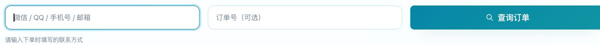

# ChatGPT购买后怎么查订单？游客查单、会员优惠与开发票

[返回指南首页](../README.md) · 内容核对：2026-10-01

付款后找不到订单，先确认**下单时有没有登录商城账号**。现在是否已经登录，与当时的下单方式不一定相同。

## 按下单时的身份选择入口

| 下单时的情况 | 应该怎样查询 |
|---|---|
| 没登录，直接填写联系方式购买 | 进入[游客查单](https://ai0111.com/guest/orders)，输入当时填写的联系方式；有订单号时可一并填写以缩小范围 |
| 登录 FlowAI 账号后购买 | 登录同一个商城账号，进入[我的订单](https://ai0111.com/me/orders) |
| 游客购买后才注册了商城账号 | 那笔旧订单仍去游客查单，不会自动并入新账号 |
| 记不清有没有登录 | 先核对当时的订单记录和联系方式；个人中心没有订单时，再检查游客查单 |

手机上可以从商城菜单找到“游客查单”；登录后使用“我的订单”。通过上表的链接也能直接进入对应页面，会员入口可能先要求登录。

## 游客查单，按这三步操作

1. 打开[游客查单](https://ai0111.com/guest/orders)，在第一个输入框填写**下单时的联系方式**。
2. 有订单号时填入第二个输入框；没有订单号时可以留空。
3. 点击「查询订单」，在查询结果中点「查看详情」，查看付款状态、交付内容和需要填写的资料。

*图：2026年10月1日真实查单页面的空白输入区域；未查询或展示客户订单。手机上的输入框可能上下排列，填写内容相同。*

## 游客查询不到时，逐项检查

1. 使用**下单时填写的联系方式**。不要因为后来注册了另一个邮箱，就改用新邮箱查询旧订单。
2. 检查复制时是否带入多余空格、输错字符，订单号是否属于这一笔购买。
3. 换过手机或浏览器时，原来保存的查单信息可能不在当前浏览器中，需要重新填写。
4. 不要把“没有收到邮件”当成“没有订单”的唯一依据，先进入查单页面核对。
5. 仍找不到时，使用商城“联系客服”，在私下沟通中提供必要的订单定位信息。不要为了找回原订单重新购买一次。

## 老用户重新购买，怎样避免漏用会员身份？

很久没有登录、清理过浏览器数据或换设备后，商城可能处于未登录状态。准备购买时先看登录入口；已有账号可直接登录，不必重新注册一个。

如果从商品的注册优惠入口进入注册页，页面上方有“已有账号？直接登录”。登录后回到商品，重新核对适用的会员价和结算金额，再付款。

新注册用户需要按页面完成邮箱验证。会员优惠需符合当前账号、商品和活动条件，不是所有商品都会减价。

## 为什么登录后或选择开票后价格会变化？

页面中的金额可能对应不同阶段，核对时看金额旁边的说明：

| 阶段 | 金额的含义 |
|---|---|
| 游客查看商品 | 当前商品售价，以及适用时显示的注册/登录优惠提示 |
| 符合条件的会员查看商品 | 展示适用优惠后的金额，旁边保留原价供比较 |
| 调整数量或进入结算 | 按该订单实际商品、数量和适用优惠重新核算 |
| 选择需要发票 | 按开票选项与页面规则计算费用，最终金额可能改变 |
| 使用已有商城余额（如适用） | 需区分余额抵扣与实际在线支付的部分 |

核对顺序是：**商品和数量 → 适用优惠 → 开票选项 → 余额抵扣（如有）→ 最终在线付款金额**。

多件订单的优惠不一定是单件优惠乘以数量。不要只拿首页单件展示金额去推算整单，也不要把不同开票选择下的两个金额直接比较。

## 购物时可以不使用余额吗？

可以。登录购买、且结算页提供「优先使用商城余额」选项时，**取消勾选，再确认在线付款金额**，即可保留这次没有用于抵扣的余额。若该订单明确提示仅支持钱包余额支付，则按该提示处理。

使用余额时，要分清三个数字：订单应付总额、余额抵扣、在线支付。余额减少不是额外优惠，在线支付较少也不表示订单总价变低。

**邀请奖励可以跨月积攒，符合条件的未使用奖励满30元可申请提现。** 是否可提现看邀请页面的「可提现奖励」，不能把充值等普通余额或待入账奖励都算进去。购物使用余额时，先扣普通余额，再扣邀请奖励；具体活动条件和申请入口以当前[邀请有礼](https://ai0111.com/me/invite)页面为准（需登录）。

## 需要发票，在哪一步选择？

购买符合条件的商品时，应在**付款前**选择“需要发票”，阅读开票说明并核对调整后的金额。当前商城提供企业数电普通发票选项。

*图：购前选择是否开票。截图中的费用提示以下单页面当前显示为准。*

付款后的操作：

1. 按原购买身份查到订单，点「查看详情」。确认是已付款、需要开票的那笔订单。
2. 在开票区域点「填写开票资料」，填写「企业名称」「纳税人识别号」「接收邮箱」，备注按需要填写。部分人工交付订单会先进入「填写开票资料」页面。
3. 核对资料后点「提交开票信息」；单独资料页则点「提交开票资料并继续」。看到提交成功提示后，按页面指引继续交付或查看进度。
4. 留意接收邮箱及订单的开票状态；订单提供「查看电子发票」链接时，可以从该入口查看。

| 开票状态 | 下一步 |
|---|---|
| 待提交资料 | 填写并提交企业名称、税号和接收邮箱 |
| 待审核 / 开票中 | 资料已经提交，留意订单和接收邮箱 |
| 已退回 | 阅读退回原因，按提示更正后重新提交 |
| 已开票 | 查看接收邮箱；订单有电子发票链接时从该入口查看 |

开票范围、退款后的处理及进度以订单实际提示为准。如果付款时未选开票，先联系客服核对处理方式，不要自行购买补差价商品。Pro 500美元档先通过人工联系页确认开票和付款安排，不套用普通商城已付款订单流程。

发票资料包含企业或个人信息，请在商城指定入口提交。GitHub 文档仓库不受理开票申请，也不应上传发票截图作为公开反馈。

## 联系客服时，怎样把问题说清楚？

按这个顺序描述，通常更容易定位：

- 下单时是游客还是已登录会员；
- 问题发生在哪一步，例如“已扣款但订单待支付”或“兑换任务完成但账号套餐未变”；
- 订单信息和必要的付款记录，通过商城客服私下提供；
- 已做过哪些检查，避免重复操作。

截图应遮盖不相关的个人信息，不包含密码、登录验证码、会话凭据或完整兑换码。文档错误可以按[贡献说明](../CONTRIBUTING.md)提交更正；订单、退款与开票问题请走商城客服。

[打开 FlowAI 商城](https://ai0111.com/) · [返回购买与续费步骤](buy-and-renew.md)
