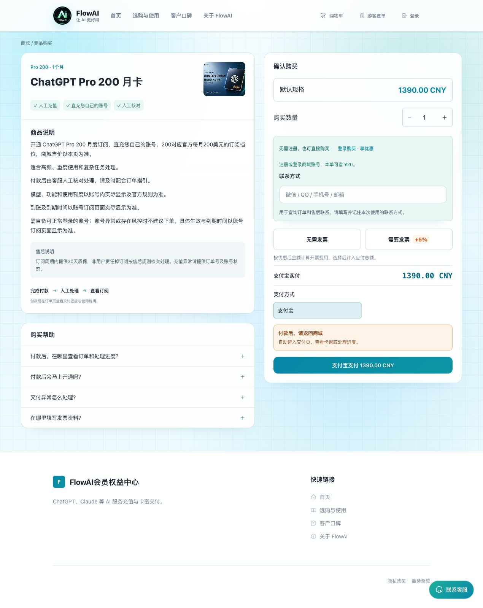

# ChatGPT Pro 怎么充值和续费？Pro5x、Pro 200、Pro 500 国内购买指南

[返回指南首页](../README.md) · 内容核对：2026-10-04

想给自己的 ChatGPT 账号开通 Pro，先确认账号可正常登录、当前套餐与到期时间，再选适用的商品档位。本文按 FlowAI 当前公开页面说明人民币购买、人工交付与续费步骤；不承诺固定任务次数或所有模型无限使用。

## Pro5x、Pro 200 与 Pro 500 怎样选？

| 当前商城商品 | 先评估的需求 | 购买与交付 |
|---|---|---|
| Pro5x 月卡 | Plus 额度已影响工作，准备比较更高用量 | 商城支付宝付款后自动发兑换码，按订单教程自助提交 |
| Pro 200 月卡 | 有明确的高强度使用需求，再比较当前权益和成本 | 商城付款后人工处理，按订单说明核对账号与开通安排 |
| Pro 500 月卡 | 更高档位的额外投入能解决实际工作中断 | 先联系客服确认付款和人工开通安排 |

官方当前列出 Pro 多个价格档位，具体权益看[官方套餐说明](https://learn.chatgpt.com/docs/pricing)及自己的账号。商城人民币售价、活动、开票金额与美元档位不是同一个价格，均以当前页面为准。

## 旧教程里的 Pro20x、10x 怎么理解？

FlowAI 当前公开名称已改为 **ChatGPT Pro 200 月卡**，原链接仍为 `/products/ChatGPT%20Pro20`，用于保留入口。旧名称或其他网站的倍率说法不能据此推定所有任务固定增加多少倍，更不能仅凭旧截图决定今天的权益。

Pro5x 按商城当前名称展示；模型、功能、用量与最终生效时间以实际账号为准，不把“高档位”写成无条件无限使用。

## Pro5x 自助月卡怎么充值？

进入 [Pro5x 商品页](https://ai0111.com/products/ChatGPT%20Pro5x)，确认账号适用条件，选择登录购买或游客购买，填写需要的信息、选择是否开票，再核对应付金额。当前页面提供支付宝，其他支付宝内付款方式以本次收银台为准。

付款确认后，在订单领取兑换码，按教程自助提交开通，再回同一个 ChatGPT 账号查看套餐。[完整五步操作](buy-and-renew.md)

## Pro 200：付款后按订单安排人工处理

*图：2026年10月4日公开页面，联系方式为空，未下单。原商品链接保留，当前名称和条件以页面显示为准。*

1. 打开 [Pro 200 商品页](https://ai0111.com/products/ChatGPT%20Pro20)，核对账号状态、周期与交付说明。
2. 选择购买身份、数量与开票需求，核对金额后按页面付款。
3. 付款后通过原订单按说明等待或联系人工处理，不套用 Plus 自动发码流程。
4. 处理完成后，在提交开通的同一个 ChatGPT 账号核对套餐及到期时间。

账号异常或存在风控时，不建议未经确认就下单；具体账号适用与售后按当前商品说明处理。

## Pro 500：先联系客服，再确认付款与开通

*图：2026年10月4日真实页面，展示人工联系入口，未进行付款或提交联系方式。*

进入 [Pro 500 商品页](https://ai0111.com/products/chatgpt-pro-500)，先选择数量与开票需求，核对参考总价，按页面要求填写联系方式，再点「联系客服开通」。联系页提供购买信息及客服入口，由客服确认安排后继续。

**进入联系页本身不创建商城订单、不扣余额，也不表示付款完成。** 不根据截图自行转账，不套用自助月卡付款后自动发码的步骤。

## 已有 Pro，怎样续费或换档？

续费前先看当前到期日和新商品是否适用，确认剩余时间怎么处理。不默认提前充值会自动叠加天数，也不默认升级会保留原套餐的全部剩余时间。

已有开通任务正在处理时，先完成或核查原任务，不重复提交新兑换码。用了多个账号的用户，续费前再核对一次账号，避免买对套餐却查看了另一个账号。

## 购买后的问题，分别处理

- **付款结果不清楚：** 回原订单与支付工具核对，不重复付款。
- **人工交付未完成：** 看原订单交付说明，通过商城客服核查处理状态。
- **任务完成但套餐未变：** 核对当前登录账号和开通账号是否一致，再按订单反馈。
- **Codex 提示 API 余额不足：** 检查认证与计费入口，Pro 不是 API 余额。[Codex 与会员区别](codex-and-chatgpt.md)
- **找不到订单或发票入口：** 按原购买身份查询。[游客查单与企业开票](orders-and-invoices.md)

## 继续阅读

[Plus / Pro 套餐选择](choose-plan.md) · [支付方式比较](payment-methods.md) · [朋友帮买 Pro](friend-payment.md) · [返回 FlowAI 商城](https://ai0111.com/)

本文是 FlowAI 自营商品公开流程说明，不是 OpenAI 官方文档或实际充值成功记录。本次只核对页面与资料，没有进行付款、兑换、账号开通或正式开票。
